# GitOps с FluxCD - infra-repo

Данный репозиторий содержит описание инфраструктуры при GitOps-подходе с использованием FluxCD.

**Другие репозитории:**

infra-repo: https://github.com/tclutin/infra-repo (текущий)

apps-repo: https://github.com/tclutin/apps-repo (podinfo)


## Установка FluxCD

  Flux был установлен с помощью **Bootstrap**, который автоматически развертывает Flux контроллеры в k8s и настраивает их для синхронизации состояния кластера с Git-репозиторием. При этом **Bootstrap** автоматически пушит манифесты Flux в репозиторий для управлениям им.

*The recommended way of installing Flux on Kubernetes clusters is by using the bootstrap procedure.*

**Основные шаги:**

1.  Проверена совместимость k8s-кластера: `flux check --pre`
2.  Создан Github-токен на 2 репозитория: infra-repo, apps-repo (были созданы заранее)
3.  Токен был экспортирован в переменные окружения
```bash
export GITHUB_TOKEN=<github-token>
```

4.  Затем была выполнена **Bootstrap** установка в clusters/staging в наш infra-репозиторий

```bash
flux bootstrap github \
  --token-auth \
  --owner=tclutin 
  --repository=infra-repo \
  --branch=main \
  --path=clusters/staging \
  --personal
```

5. После **Bootstrap** установки проверили корректность работы flux: `flux check`

## Структура репозитория

```bash
├── apps
│   ├── base
│   │   └── podinfo
│   │       ├── kustomization.yaml
│   │       ├── namespace.yaml
│   │       ├── release.yaml
│   │       └── repository.yaml
│   └── staging
│       ├── kustomization.yaml
│       └── podinfo-values.yaml
├── clusters
│   └── staging
│       ├── apps.yaml
│       └── flux-system
│           ├── gotk-components.yaml
│           ├── gotk-sync.yaml
│           └── kustomization.yaml
└── README.MD

#images только для отчета и фото
```

## Проверка работоспособности podinfo

Проверим, что поды живые и посмотрим их логи. Все оки.

```bash
kubectl get pods -n podinfo
```

```bash
kubectl logs <pod> -n podinfo
```

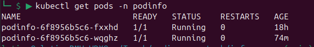

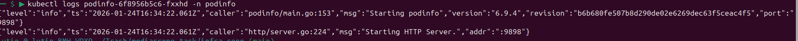

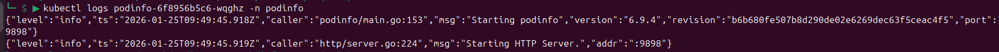

Посмотрим порты нашего сервиса, который связан с подами podinfo
```bash
kubectl get svc -n podinfo
```

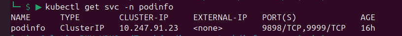

Прокинем порт сервиса 9898 на локалку.
```bash
kubectl port-forward svc/podinfo 8082:9898 -n podinfo
```

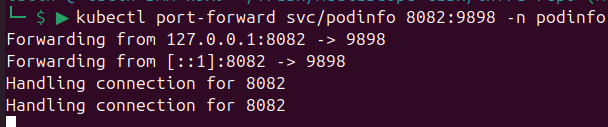

Заходим на сайт. Все работает. 

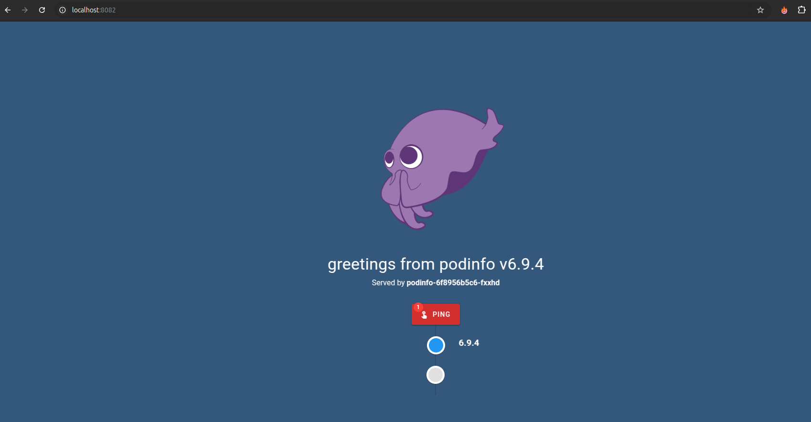


## Что ломал?

#### Указал несуществующий repository для podinfo в /apps/staging/podinfo-values.yaml

Смотрим, что происходит с подами в нашем неймспейсе
```bash
kubectl get pods -n podinfo
```

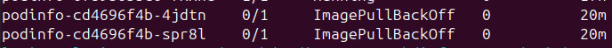

Видно по статусу ErrImagePull/ImagePullBackOff, что не можем подтянуть image. Но все равно посмотрим логи и ивенты для детальной информации.

```bash
kubectl logs podinfo-cd4696f4b-4jdtn -n podinfo
```

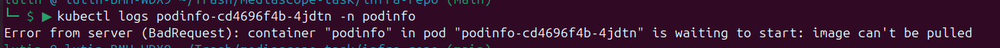

```bash
kubectl events podinfo-cd4696f4b-4jdtn -n podinfo
```

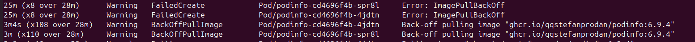

Видим из ивента, что указан неверный репозиторий: ```ghcr.io/qqstefanprodan/podinfo```.

**(решение)** Теперь нам нужно поправить название репозитория в /apps/staging/podinfo-values.yaml на ```ghcr.io/stefanprodan/podinfo```. 


Так как у нас FluxCD мониторит репозитории, то просто пушим изменения и ждем. Все сработало.
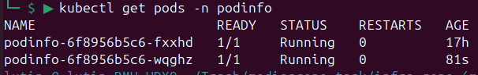

#### Cломал наш git source для apps-repo, перенес его из flux-system в namespace podinfo

Также удалил helmchart из k8s, чтобы он его не подтягивал из "кеша" при обновлении values

```
kubectl delete helmchart flux-system-podinfo -n flux-system
```

Теперь посмотрим, что произошло. К примеру мы поменяли helmchat-манифесты/values, но обновления не закатились, хотя прежние поды работают. Раз у нас Flux, то скорей всего произошло что-то с helmrelease или gitrepository в нашем случае, ведь синхронизации нет. 

Смотрим ивенты helmrelease.

```bash
kubectl events helmrelease podinfo -n flux-system
```

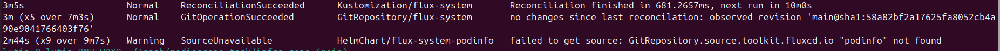

Видим, что helmchat не может найти git source по имени "podinfo". Теперь проверим gitrepository в неймспейсе flux-system с имененм "podinfo".

```bash
kubectl get gitrepository -n flux-system
```

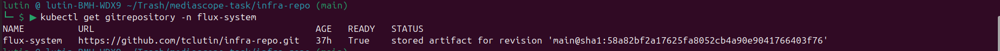

В неймспейса flux-system отсутствует ресурс gitrepository с именем "podinfo".

**(решение)** Проверим наши манифесты с gitrepository и helmrelease, они должны находится в 1 namespace, в нашем случае в flux-system. GitRepository оказался в namespace podinfo, а HelmRelease в flux-system, а теперь просто меняем в GitRepository namespace: podinfo на namespace: flux-system. И все работает.


P.S забыл пункт добавить, если посмотреть ивенты ресурса gitrepository с именем podinfo, когда он находился в namespace podinfo, то там были ошибки вида failted to get secret, что логично, ведь секреты находятся в namespace flux-system

#### Просто сломал структура Deployment в Helm-чарте в apps-repo и запушил


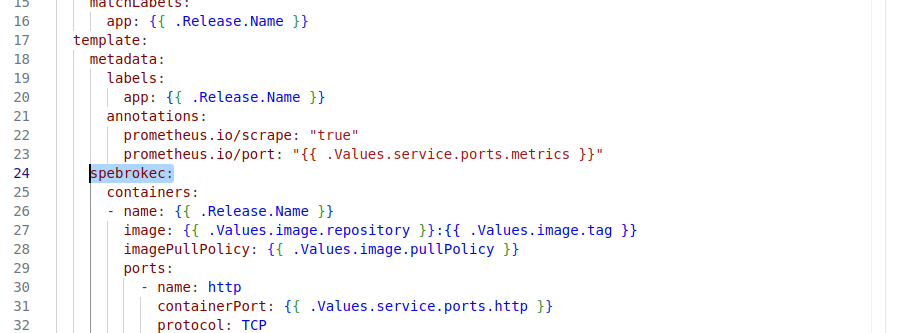


Релиз не закатилился, поды не обновились. Сразу смотрим:

```bash
kubectl get helmrelease -n flux-system
```

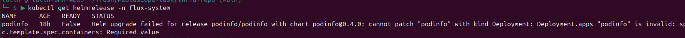

**(решение)** очевидно что тут ошибка в структуре Deployment-а в helm-чарте, просто ищем ошибку и исправляем, пушим, все ок.

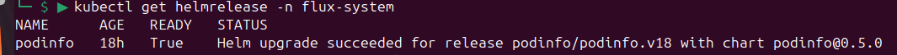